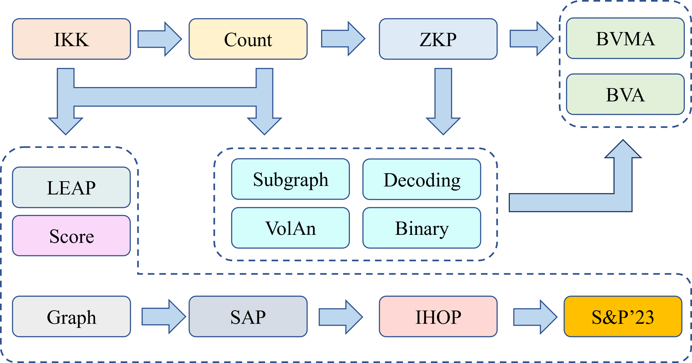
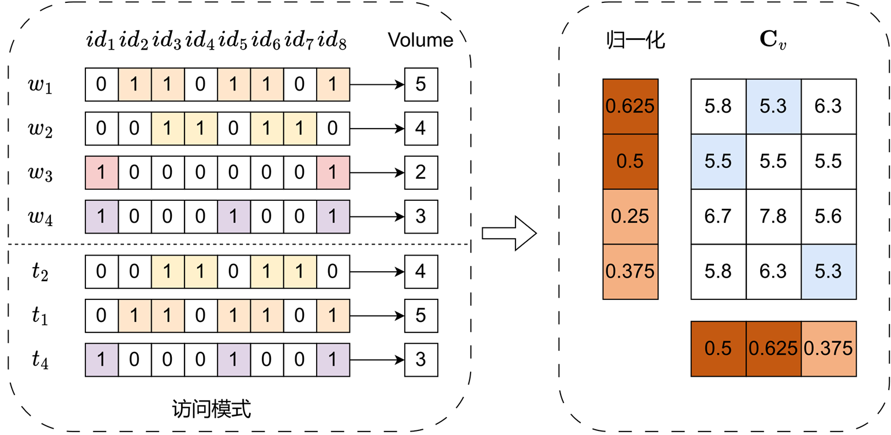
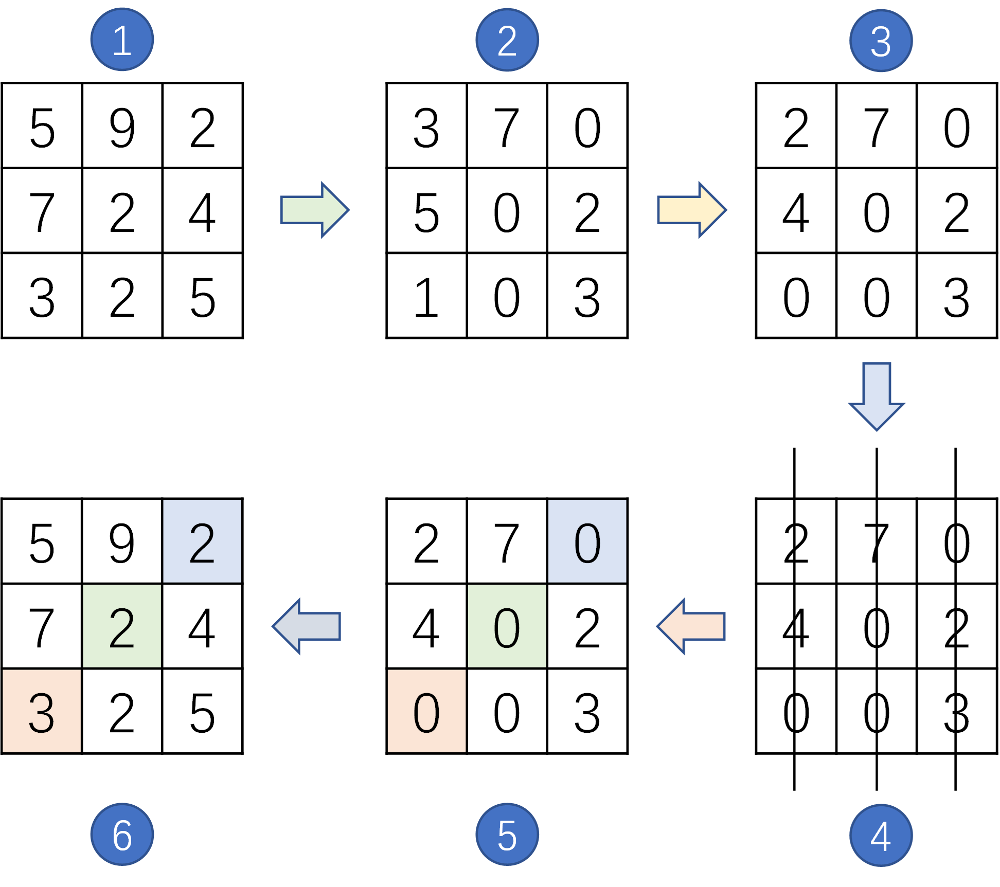
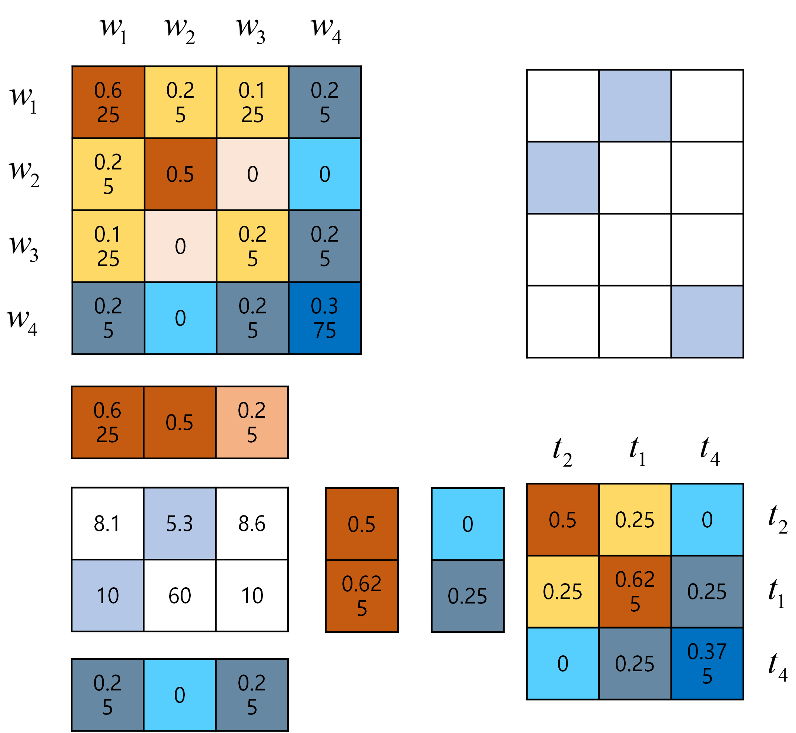
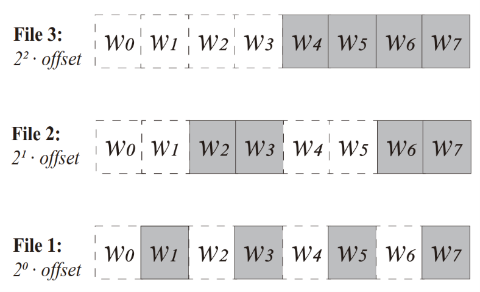
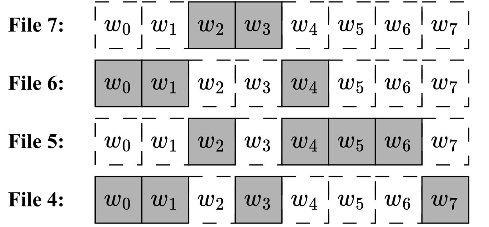

# 
基于似然估计的可搜索加密查询恢复攻击综述

**摘要**：云计算技术的发展大大方便了大数据时代海量数据的存储与计算问题，极大地提高了普通用户处理数据的能力，但用户将数据存储于云服务器的同时也泄露了个人及他人的隐私，恶意的服务器提供商可以随意的收集用户的个人数据，用于非法用途。可搜索加密技术的提出既解决了数据隐私安全问题，也同样保留了云服务器对数据的处理能力，即检索等相关操作，在保障数据隐私安全的同时，极大地方便了用户的计算操作，然而，即使该技术达到了可喜的效果，仍然有恶意的攻击者利用检索查询的相关泄露信息对可搜索加密方案实施攻击，近年来，大量的针对可搜索加密的查询恢复攻击破坏了用户的隐私，非常有必要对这些攻击进行梳理总结，了解其攻击形式、其利用泄露、其算法原理有助于设计更加安全可靠的可搜索加密方案，文章对近些年的查询恢复攻击进行梳理和总结，考虑5种泄露下的攻击现状，重点从两类基于似然估计的查询恢复攻击进行阐述，了解其攻击原理及对部分泄露防御的攻击措施，旨在反思可搜索加密的泄露与进一步防御泄露举措。

**关键词**：可搜索加密；攻击；似然估计；查询恢复；泄露

## 引言

随着云计算技术的发展，更多计算和存储的任务交付于云服务器，但与此同时，安全问题接踵而至，对于用户上传到云服务器上的数据，其隐私性并不被云所保护，甚至服务器可以监守自盗，这样的问题对于用户及其数据的隐私是极具破坏性的，一种可行的办法是对上传至服务器的数据进行加密，但这样做又会失去对数据检索的优势，用户并不能辨别上传至服务器的数据，如果需要某个数据必须全部下载在解密查找，这便丧失云计算的计算优势。2000年，Song等人[[1](#Practical_techniques_for_searches_on_enc)]提出可搜索加密，对于加密存储于服务器的数据，其检索特性并不会因此丧失，随后多年，基于对称和非对称的可搜索加密方案迭出不穷[[2](#Public_Key_Encryption_with_Keyword_Searc)], [[3](#Searchable_Symmetric_Encryption__Improve)]。Goh等人[[4](#Secure_Indexes)]首先提出安全索引的概念及其安全性证明，在此基础上，Curtmola等人[[3](#Searchable_Symmetric_Encryption__Improve)]对可搜索加密的定义及其涉及的安全，基本泄露给出形式化定义，并基于倒排索引给出两种不同安全的可搜索加密方案，提高了检索效率的同时保障安全性。至今，对于可搜索加密的研究蓬勃发展，从动态更新、多用户、可验证、联合查询、通配符查询等多角度[[5](#Boolean_Searchable_Symmetric_Encryption_)]–[[10](#Dynamic_Searchable_Symmetric_Encryption)]的方案层出不穷。

可搜索加密技术在提供安全与高性能计算的同时，也面临着诸多的威胁，用户数据的隐私或许因为可搜索加密的查询泄露而遭到破坏。一般而言，攻击者会利用相关辅助信息及对加密数据查询时的泄露模式发起泄露滥用攻击[[11](#A_Highly_Accurate_Query_Recovery_Attack_)]–[[24](#Leakage_Models_and_Inference_Attacks_on_)]，旨在恢复加密数据文档及用户的查询，当用户的查询被成功破解后，根据泄露模式，加密数据文档中包含的信息也将暴露给攻击者。攻击者包括第三方或云服务器自身，第三方攻击者可以通过监听信道获取相关泄露模式进而进行查询恢复，同时在多用户模式下也可以通过注入设定好的特定文件发起主动攻击[[25](#All_Your_Queries_Are_Belong_to_Us__The_P)], [[26](#High_Recovery_with_Fewer_Injections__Pra)]，云服务器一般是诚实且好奇的，它会尽可能的了解加密数据及相关查询的泄露模式，基于此，用户的查询可能被云服务器知晓。

可搜索加密技术结合云计算技术给用户存储和处理海量数据提供了便捷和安全，即使越来越多更高安全的可搜索加密方案[[27](#Differentially_Private_Access_Patterns_f)]–[[33](#ShadowCrypt__Encrypted_Web_Applications_)]被提出，但同时别有用心的攻击者也在更新攻击技术，研究攻击者的攻击方法及原理有助于更安全的可搜索加密方案的产出，文章着重从近年来的两篇较为强大的攻击SAP(search and access pattern-based attack)[[12](#Hiding_the_Access_Pattern_is_Not_Enough_)]和IHOP(Iterative Heuristic algorithm to solve a quadratic Optimization Problem)[[13](#IHOP__Improved_Statistical_Query_Recover)]进行研究，以反思可搜索加密的泄露与防御。

## 相关攻击概述

### 攻击利用泄露及知识

对于Curtmola等人[[3](#Searchable_Symmetric_Encryption__Improve)] 给出的基本泄露，及其后续可搜索方案的查询泄露，基本认为查询泄露模式主要分为两类：

- 模式：根据用户的查询，服务器相应的返回查询结果，每个查询的查询结果即加密文档的标识符将被泄露，查询与各个标识符的对应关系将被观察到。
- 搜索模式：对于两个查询，辨别是否为同一查询关键字。

特别地，除两类基本泄露模式外，还有一些引申泄露：

- Volume模式：即每个查询返回文档结果的数量。
- 共现模式：对于两个查询，共现信息表示二者共同包含的文档个数。
- Size模式：查询返回的每个文档的存储大小或总大小。

其中访问模式泄露自然地造成Volume模式和共现模式泄露，同时后二者也可能单独泄露，在一些结构化加密，ORAM中会出现这种状况，共现模式泄露自然地造成Volume模式泄露，对攻击者而言，除了各类模式泄露信息可以使用外，攻击者还需要获取到上传到云服务器上的数据的全部或部分信息知识，近年来，攻击者也可以使用与云服务器上存储的加密数据同分布的数据的知识进行攻击[[11](#A_Highly_Accurate_Query_Recovery_Attack_)]–[[14](#Rethinking_Searchable_Symmetric_Encrypti)]。

表 1 现有攻击

|     攻击     | 类型 | 共现 | 访问 | Volume | 搜索 | Size |       辅助知识       | 针对防御                        |
| :----------: | :--: | :--: | :--: | :----: | :--: | :--: | :------------------: | :------------------------------ |
|   IKK[15]    | 被动 |  ✅   |  ✅   |        |      |      |  全部文档，已知查询  |                                 |
|  Count[17]   | 被动 |  ✅   |      |   ✅    |      |      |  部分文档，已知查询  |                                 |
|  Graph[22]   | 被动 |  ✅   |      |        |      |      |      非索引文档      | Aegis[28], ShadowCrypt[33]      |
|   Ning[19]   | 被动 |  ✅   |  ✅   |        |      |      |  全部文档，部分文档  |                                 |
|   LEAP[18]   | 被动 |  ✅   |  ✅   |        |      |      |  全部文档，部分文档  |                                 |
|  Score[11]   | 被动 |  ✅   |      |        |      |      | 非索引文档，已知查询 |                                 |
|    Xu[16]    | 被动 |  ✅   |  ✅   |        |      |      |  全部文档，部分文档  |                                 |
|   IHOP[13]   | 被动 |  ✅   |      |   ✅    |  ✅   |      |      非索引文档      | CLRZ[27], OSSE[30], Pancake[31] |
|   VAL[23]    | 被动 |  ✅   |  ✅   |   ✅    |      |      |  全部文档，部分文档  |                                 |
|  S&P’23[14]  | 被动 |  ✅   |      |        |      |      |      非索引文档      | CLRZ[27], PPYY[29], KM19[34]    |
|   SAP[12]    | 被动 |      |  ✅   |   ✅    |      |      |      非索引文档      | CLRZ[27], PPYY[29], SEAL[32]    |
|   Liu[21]    | 被动 |      |      |   ✅    |      |      |          -           |                                 |
| Subgraph[20] | 被动 |      |  ✅   |        |  ✅   |      |       部分文档       |                                 |
|  VolAn[20]   | 被动 |      |      |   ✅    |  ✅   |      |       部分文档       |                                 |
|   BVA26[]    | 主动 |      |      |        |  ✅   |  ✅   |          -           | TC[25], SEAL[32], ShieldDB[35]  |
|   BVMA26[]   | 主动 |      |  ✅   |   ✅    |  ✅   |  ✅   |          -           | TC[25], SEAL[32], ShieldDB[35]  |
|   ZKP[25]    | 主动 |      |  ✅   |        |      |      |          -           |                                 |
| Decoding[20] | 主动 |      |      |        |  ✅   |      |          -           |                                 |
|  Binary[20]  | 主动 |      |      |        |  ✅   |      |          -           |                                 |

### 攻击现状

根据可搜索加密的攻击类型，可分为泄露滥用攻击（被动）和注入攻击（主动）两类，针对不同泄露模式，存在多种攻击方式，如表 1所示。

大多数攻击依赖访问模式、共现模式、Volume模式的泄露，同时被动攻击需要一定的辅助信息才能成功，辅助信息包括上传的全部文档、部分文档，或者与上传文档具有相同分布的非索引文档，一些攻击还依赖于已知查询，近年来，对于全部文档和部分文档的依赖减弱，大多攻击[[11](#A_Highly_Accurate_Query_Recovery_Attack_)]–[[14](#Rethinking_Searchable_Symmetric_Encrypti)]转向用非索引文档做辅助信息，同时对于一些防御措施[[27](#Differentially_Private_Access_Patterns_f)]–[[33](#ShadowCrypt__Encrypted_Web_Applications_)]发起有效攻击，这进一步表明，明晰攻击原理，设计更加行之有效，兼顾效率和安全的可搜索加密方案刻不容缓。

目前的针对单关键字可搜索加密检索的经典攻击发展关联图如图 1所示，自IKK攻击以来，大多攻击延续各类模式泄露造成的隐患，基于各类优化算法设计越来越强大且有针对性的攻击，提出对可搜索加密安全性的质疑。

## SAP攻击

在前人的基础上，Oya等人[[12](#Hiding_the_Access_Pattern_is_Not_Enough_)]结合Pouliot等人[[22](#The_Shadow_Nemesis__Inference_Attacks_on)]基于图匹配问题的Graph攻击和Liu等人[[21](#Search_pattern_leakage_in_searchable_enc)]基于搜索模式泄露的攻击，提出了针对Volume模式和搜索模式泄露的SAP攻击，其攻击思想主要是利用两种泄露构造似然函数进行最大似然估计，旨在进行查询恢复。

### 攻击概述

攻击者可以通过观察一定时间范围内的查询可以得知查询令牌\\(t\_{j},j\in [m]\\)及其对应结果的访问模式\\({{\mathbf{a}}\_{j}},({{N}\_{d}}\times 1)\\)，其中\\({{N}\_{d}}\\)为加密文档数量，进而得知Volume模式\\(\mathbf{v}=[{{v}\_{1}},\cdots ,{{v}\_{m}}]\\)，其中\\({{v}\_{j}}=|{{\mathbf{a}}\_{j}}|/{{N}\_{d}}\\)，同时从辅助数据集中提取关键字列表\\(w_{i},i\in [n]\\)及其对应Volume值\\(\widetilde{\mathbf{v}}=[{{\widetilde{v}}\_{1}},\cdots ,{{\widetilde{v}}\_{n}}]\\)，对于查询恢复攻击，旨在恢复查询令牌对应的底层关键字，即对应一个单射\\(p(\cdot ):[m]\to [n]\\)，攻击者的任务是找到这样的单射，对于所有查询令牌均给出唯一的一个对应底层关键字，即构建\\((n\times m)\\)的矩阵\\(\mathbf{P}\\)：


$$
\mathbf{P}\_{i,j} =
\begin{cases}
1, & \text{if } i = p(j) \\
0, & \text{otherwise}
\end{cases}
$$

SAP攻击还需要利用搜索模式，攻击者可以观察到每个查询令牌\\(j\\)在\\(\rho\\)个时间范围内的搜索频率\\({{\mathbf{f}}\_{j}}=[{{f}\_{j,1}},\cdots ,{{f}\_{j,\rho }}]\\)，构建频率矩阵\\(\mathbf{F},(m\times \rho )\\)。同样，攻击者通过谷歌趋势[[1\]](#_ftn1)得到互联网上查询的相关频率信息得到\\({{\widetilde{\mathbf{f}}}\_{i}}\\)和\\(\widetilde{\mathbf{F}}\\)。

在各类辅助信息和观察样本条件下，构造似然函数为

$$
\mathbf{P}=\underset{\mathbf{P}\in \mathcal{P}}{\mathop{\text{argmax}}}\,\text{Pr}(\mathbf{F},\mathbf{\eta },\mathbf{v},{{N}\_{d}}|\widetilde{\mathbf{F}},\widetilde{\mathbf{v}},\mathbf{P})
$$

------

[[1\]](#_ftnref1) https://trends.google.com/trends

其中\\(\mathbf{\eta }=[{{\eta }\_{1}},{{\eta }\_{2}},\cdots ,{{\eta }\_{\rho }}]\\)为每个时间范围内查询数量的向量，\\(\mathcal{P}\\)为所有\\(\mathbf{P}\\)的可能取值。

通过最大似然估计参数值\\(\mathbf{P}\\)，寻找局部最佳的\\(\mathbf{P}\\)取值，显然观察到的查询行为，即查询频率，与查询响应的Volume值是独立的，由此式(2)中的似然概率函数可转换为

$$
\Pr(\mathbf{F},\boldsymbol{\eta},\mathbf{v},N_d \mid \widetilde{\mathbf{F}},\widetilde{\mathbf{v}},\mathbf{P}) =
\Pr(\mathbf{F},\boldsymbol{\eta} \mid \widetilde{\mathbf{F}},\mathbf{P}) \cdot
\Pr(\mathbf{v},N_d \mid \widetilde{\mathbf{v}},\mathbf{P})
$$
式(3)中，每个时间范围内查询的数量\\(\mathbf{\eta }\\)和加密文档的数量与\\(\mathbf{P}\\)独立，用户搜索关键字生成的每个陷门与其他陷门独立，每个关键字\\(i\in [n]\\)的查询再时间范围\\(k\in [\rho ]\\)内遵循\\({\eta} \_{k}}\\)次实验，概率为\\({{\widetilde{f}}\_{k}}\\)的多项分布，则依条件概率模型，有

$$
\begin{aligned}
\Pr\left( \mathbf{F}, \boldsymbol{\eta} \mid \widetilde{\mathbf{F}}, \mathbf{P} \right)
&= \Pr\left( \boldsymbol{\eta} \right) \cdot \Pr\left( \mathbf{F} \mid \widetilde{\mathbf{F}}, \boldsymbol{\eta}, \mathbf{P} \right) \\
&= \Pr\left( \boldsymbol{\eta} \right) \cdot \sum\_{k=1}^{\rho} \Pr\left( \mathbf{f}\_k \mid \widetilde{\mathbf{f}}\_k, \eta\_k, \mathbf{P} \right) \\
&= \Pr\left( \boldsymbol{\eta} \right) \cdot \sum\_{k=1}^{\rho} \eta\_k! \sum\_{j=1}^{m} \frac{\left( \widetilde{f}\_{p(j),k} \right)^{\eta\_k f\_{j,k}}}{\left( \eta\_k f\_{j,k} \right)!}
\end{aligned}
$$

同理，当用户查询\\({{w}\_{i}}\\)时，其对应的查询令牌的响应Volume量满足\\({{N}\_{d}}\\)次实验，成功概率为\\({{\widetilde{v}}\_{i}}\\)的二项分布，有
$$
\begin{aligned}
\Pr\left( \mathbf{v}, N\_d \mid \widetilde{\mathbf{v}}, \mathbf{P} \right)
&= \Pr\left( N\_d \right) \cdot \Pr\left( \mathbf{v} \mid \widetilde{\mathbf{v}}, \mathbf{P} \right) \\
&= \Pr\left( N\_d \right) \cdot \sum_{j=1}^{m}
\binom{N\_d}{N\_d v\_j} \cdot
\widetilde{v}\_{p(j)}^{N\_d v\_j} \cdot
\left(1 - \widetilde{v}\_{p(j)} \right)^{N\_d(1 - v\_j)}
\end{aligned}
$$
对似然函数式(6)，式(8)取对数，以及去除与\\(\mathbf{P}\\)无关的常量，不对估计结果有影响，同时转换形式为求解最大化问题，构造\\(n\times m\\)矩阵\\({{\mathbf{C}}\_{f}}\\)和\\({{\mathbf{C}}\_{v}}\\)

$$
{{({{\mathbf{C}}\_{f}})}\_{i,j}} = -\sum\_{k=1}^{\rho} \eta\_{k} f\_{j,k} \cdot \log\left( \widetilde{f}\_{i,k} \right)
$$

$$
{{({{\mathbf{C}}\_{v}})}\_{i,j}} = -\left[
N\_d \cdot v\_j \cdot \log \widetilde{v}\_i + 
N\_d \cdot (1 - v\_j) \cdot \log (1 - \widetilde{v}\_i)
\right]
$$

其中增添负号用于使用匈牙利算法[[36](The#The_Hungarian_method_for_the_assignment_)]求解指派问题:
$$
\mathbf{P} = \underset{\mathbf{P} \in \mathcal{P}}{\mathop{\text{argmin}}} \, \text{ tr}(\mathbf{P}^{T}(\mathbf{C}\_v + \mathbf{C}\_f))
$$

式(11)中矩阵的迹即原先式(2)要求解的表达式。SAP攻击还增添了关于频率信息和Volume信息的权重调节参数\\(\alpha \in [0,1]\\)，修改式(11)

$$
\mathbf{P} = \underset{\mathbf{P} \in \mathcal{P}}{\mathop{\text{argmin}}} \, \text{ tr}(\mathbf{P}^{T}((1 - \alpha)\mathbf{C}\_v + \alpha \mathbf{C}\_f))
$$

如图 2所示，现有4个关键字包含在8个文档中，其相应访问模式如图所示，攻击者观察到3个查询令牌，并获取到相应Volume模式，为方便起见，示例未使用非索引文档，不失一般性，攻击者对观察到的Volume模式和辅助关键字的Volume模式按照式(12)构造似然权重矩阵，这里仅以Volume模式为例，即\\(\alpha =0\\)，求解每个观察令牌对应的关键字的最小化代价，通过匈牙利算法解决该指派问题，结果如图 2右侧所示，对应关系为\\({{t\}_{2}}\to {{w}\_{2}},{{t}\_{1}}\to {{w}\_{1}},{{t}\_{4}}\to {{w}\_{4}}\\)，恢复正确。

其中，匈牙利算法的基本流程如图 3所示：

1.  首先，每行减去最小值，即标号2；
2. 其次每列减去最小值，如标号3；
3. 之后用最少的水平或垂直线覆盖所有0，如果线数等于维数，则指派结束，如标号4，5所示，最终选择每一行和每一列中唯一指示的0作为指派结果，即可得最小代价指派，实际上这个过程是寻找二部图匹配的次优解过程；
4. 若初始矩阵不是方阵，对却行或列的部分补0即可。
### 针对防御

SAP攻击作为最近的查询恢复攻击，利用较少的观察信息和较弱的辅助信息能够达到较好的查询恢复结果，其攻击不仅对一般的可搜索加密方案有效，还对增添假阳性与假阴性访问模式的方案[[27](Differentially#Differentially_Private_Access_Patterns_f)]、Volume隐藏方案[[29](Mitigating#Mitigating_Leakage_in_Secure_Cloud_Hoste)]、利用ORAM的Volume隐藏方案[[32](S#SEAL__Attack_Mitigation_for_Encrypted_Da)]有一定效果，具体而言，SAP攻击通过对辅助数据集利用这些防御措施的构造方法改变其得到的Volume模式，尽可能的与观察到这些措施的查询结果Volume靠近，运行攻击算法可以达到一定的恢复率，这表明，可搜索加密方案在不可避免的访问模式和Volume模式泄露下，应该构造更加有效和安全的方案以抵御此类似然估计攻击。

### 应对策略

Oya等人[[12](Hiding#Hiding_the_Access_Pattern_is_Not_Enough_)]的SAP攻击利用非索引文档知识和观察到的Volume模式与搜索模式进行似然估计查询恢复，其主要思想来源于Pouliot等人[[22](The#The_Shadow_Nemesis__Inference_Attacks_on)]和Liu等人[[21](Search#Search_pattern_leakage_in_searchable_enc)]的工作，同时对几类关于可搜索加密防御攻击措施[[27](Differentially#Differentially_Private_Access_Patterns_f)], [[29](Mitigating#Mitigating_Leakage_in_Secure_Cloud_Hoste)], [[32](S#SEAL__Attack_Mitigation_for_Encrypted_Da)]进行了有效攻击，针对此类攻击，即使上述防御方案起到一定效果，但该攻击仍能有较低的恢复率，事实上，应该采取更强有力的Volume隐藏、混淆访问模式的措施，利用更有效的ORAM技术，牺牲一定的效率以达到更安全的方案设计，同时，最近的搜索模式隐藏工作[[31](Pancake:#Pancake__Frequency_Smoothing_for_Encrypt)]也在一定程度上可以抵御该攻击，可搜索加密方案设计者应从更少或更混乱的模式泄露角度入手。

## IHOP攻击

在SAP攻击的基础上，Oya等人[[12](Hiding#Hiding_the_Access_Pattern_is_Not_Enough_)]提出了针对Volume模式、共现模式和搜索模式泄露的IHOP攻击，其攻击思想主要是SAP攻击的迭代利用，将SAP未考虑的共现信息得以利用，旨在进行查询恢复。

### 攻击概述

SAP攻击只利用了观察到的Volume模式和搜索模式，对于同样引自于访问模式的共现模式没有有效利用，观察查询令牌的共现模式为\\({{\mathbf{M}}\_{i,j}}={{\mathbf{a}}\_{i}}^{T}{{\mathbf{a}}\_{j}}/{{N}\_{d}}\in [0,1]\\)，也就是说该矩阵中除了主对角线上的Volume模式外的其它有效信息被舍弃，IHOP攻击利用这些共现信息改进SAP攻击，达到更好的恢复效果，对于非索引文档中的关键字共现矩阵为\\(\widetilde{\mathbf{M}}\\)。

IHOP利用共现矩阵中的二次项需要先前恢复结果做辅助，旨在解决二次指派问题，即在查询令牌\\({{t}\_{j}}\\)指派给关键字\\({{w}\_{i}}\\)的同时将查询令牌\\({{t}\_{j'}}\\)指派给关键字\\({{w}\_{i'}}\\)，其构造似然函数的方法与SAP攻击类似，不过多出一个二次项，攻击流程如下：

1. 在辅助信息和观察信息的基础上，选定迭代次数与待匹配令牌参数，利用Volume模式运行一次SAP攻击；

2. 进入迭代，根据参数选定一定比例的待匹配令牌，同时获得待匹配关键字，进而从第一次运行SAP攻击处得到的结果获得已匹配令牌与关键字；

3. 将匹配好的令牌和关键字作为二次指派的固定指派项，即已知将查询令牌\\({{t}\_{j}}\\)指派给关键字\\({{w}\_{i}}\\)，考虑将查询令牌\\({{t}\_{j'}}\\)指派给关键字\\({{w}\_{i'}}\\)，这里利用到共现矩阵中的各个二次项系数；

4. 再次运行SAP攻击获得恢复结果；

5. 循环迭代。

IHOP攻击对SAP攻击进行了改进，充分利用了共现模式，通过多次迭代精华恢复率，以图 2为例，生成共现矩阵如图 4所示，通过流程1)得到\\({{w}\_{4}}\\)与​\\({{t}\_{4}}\\)对应，则提取出对应的二次项共现值，按照流程，计算出似然函数，同样使用匈牙利算法，得到结果，不断迭代。

### 针对防御

IHOP攻击除了继承SAP针对的防御外，还提出一种场景下对PANCAKE[[31](Pancake:#Pancake__Frequency_Smoothing_for_Encrypt)]的攻击，其主要考虑符合马尔科夫过程的查询，这些查询间存在依赖性，借此跳过PANCAKE的频率隐藏策略，IHOP攻击提出在这种场景下，PANCAKE可以被其有效攻击。

### 应对策略

与SAP攻击类似，可搜索加密方案应该考虑混淆或隐藏共现模式，搜索模式等相关泄露，一种可行的方法是高效的Volume hiding技术。

## 其他经典攻击

### IKK攻击

2012年，Islam等人[15]首次提出对可搜索加密技术的IKK攻击，IKK攻击利用访问模式及查询的共现信息运行模拟退火算法，需要与服务器上的加密文档相同的全部文档做辅助信息，同时还需要已知查询，通过模拟退火算法试图寻找NP问题的次优解，简单的说就是通过迭代比较共现量的大小差异来进行关键字与查询的匹配，该攻击设定相关退火参数，预先设定好一定匹配，具备共现信息的差异大小，运行模拟退火算法，将查询令牌跳跃式与其它关键字共现值比较，若差异比之前的小，则替换之前的匹配，周而复始，直至没有匹配被替换后，攻击结束，获得的结果属于局部最优解，该攻击首次揭示了访问模式泄露对可搜索加密方案的安全破坏性。

### Count攻击

Count攻击在IKK攻击的基础上使用了Volume模式，对于查询返回的结果，统计每个查询对应结果的数量，与已有的部分文档信息提取的关键字进行匹配，Count攻击也需要部分已知查询，其Volume值是唯一的，通过遍历未匹配结果的查询令牌，利用已知查询与余下的关键字集的共现计数进行比较，对共现计数量不同的关键字进行移除，只有剩余最后的关键字是某次循环中查询令牌的匹配。Count攻击首次用到Volume模式，对后续的攻击有指导意义。

### GraphM攻击

该攻击是SAP攻击的前身，其通过解决二部图匹配Path算法[37]进行查询恢复，对于关键字知识和观察到的查询，可以构建两个图，其节点即关键字和查询，用共现量描述两个节点之间的权重关系，即\\(\widetilde{\mathbf{M}}\\)与\\(\mathbf{M}\\)，目标是寻找到一种行列变换矩阵\\(\mathbf{P}\\)，使得\\(\mid\mid\widetilde{\mathbf{M}}-\mathbf{PM}{{\mathbf{P}}^{T}}\mid\mid\_{2}\\)最小化，其中\\(\mid\mid\cdot \mid\mid\_{2}\\)为欧几里得范数，同时考虑一个仅关注Volume值的相似矩阵，其构建方法即SAP攻击的构建方法，即\\({{\mathbf{C}}\_{v}}\\)，进行同样的似然函数构造：
$$
\text{minimize   }(1-\alpha )\mid\mid\widetilde{\mathbf{M}}-\mathbf{PM}{{\mathbf{P}}^{T}}\mid\mid\_{2}-\alpha \text{tr}({{\mathbf{C}}\_{v}}\mathbf{P})
$$
Graph攻击使用图匹配Path算法解式(13)。

### LEAP攻击

LEAP利用到访问模式泄露，其需要完整的文档知识才能攻击，考虑到每个查询的访问模式向量唯一性和共现量唯一性进行匹配，其中共现量包括关键字与关键字的共现，背景文档的共现，令牌的共现，加密文档的共现，LEAP需要利用许多信息，其攻击算法利用访问模式向量唯一性，访问模式向量的列“加和”或行“加和”唯一性，各种共现量的比较进行迭代启发，使用之前的攻击结果再启发新的攻击结果，逐步增高令牌恢复率，同时利用这些令牌恢复映射加密文件的恢复，该攻击需要较多的背景知识和较为苛刻的场景才能达到高恢复率，可以使用一些防御措施予以规避。

### Score攻击

Score攻击与SAP攻击首次用到非索引文档做背景知识，基于非索引文档的特性，主要利用共现模式泄露或Volume模式泄露等。Score攻击利用共现模式与已知查询实现攻击，首次对背景非索引文档的选择及查询分布作系统的研究。该攻击在少数已知查询的条件下，从共现矩阵中抽取对应的列，对每个观察令牌的共现序列与关键字的共现序列作欧氏距离对比，选择距离小的关键字作为该查询的匹配结果。同样的，通过已知查询恢复的令牌还可以加入已知令牌作进一步地启发。

### ZKP攻击

该攻击是首个针对可搜索加密方案的主动攻击。通过可搜索加密方案的更新算法，ZKP攻击只需注入相对于关键字空间对数级的文件个数即可利用后续查询的访问模式观察到注入的文件，进而得知用户查询的底层关键字。具体而言，对于8个关键字空间，攻击者生成\\(\lceil \log \\#W \rceil \\)个注入文件。如图 5所示，其中\\(\\#W\\)表示关键字个数，生成的3个文件中，每个文件包含一定的关键字，使得返回的文件可以唯一标识某个关键字，如查询关键字\\({{w}\_{2}}\\)，将返回010，即File 2被返回，其中\\({{w}\_{2}}\\)被唯一标识，而查询\\({{w}\_{7}}\\)，则返回File 1 2 3，也唯一标识，通过该注入攻击，所有的查询对应的关键字都将被恢复。

### BVA与BVMA攻击

BVA与BVMA攻击在ZKP攻击的基础上另辟蹊径，考虑到更广泛应用的Volume与Size泄露，其主要注入思想与ZKP大略相同，不同在于观察的角度，一个考虑访问模式，一个考虑Volume和Size，同样的，对BVA攻击考虑8个关键字，按照BVA攻击的思想，注入\\(\left\lceil \log \\#W \right\rceil =3\\)文件，其中每个文件的大小填充到\\(\gamma \cdot {{2}^{i-1}}\\)，其中\\(i\\)为表示第\\(i\\)个文件，\\(\gamma =\{\gamma \in \mathbb{N}\cap \gamma \ge \\#W/2\}\\)为注入参数，这里选定为4，即图 5中\\(offset=\gamma \\)。
如图 5所示，当关键字\\({{k}\_{i}}\\)被查询时，返回的文件大小为\\(\gamma \cdot i\\)，则3个文件的大小分别为\\(\gamma ,2\gamma ,4\gamma \\)，当查询\\({{w}\_{3}}\\)时，返回File 1 2，大小为\\(\gamma +2\gamma =3\gamma \\)，与\\(\gamma \cdot 3\\)相同，可以确定查询对应的底层关键字为\\({{w}\_{3}}\\)。
对BVMA攻击，如图 6所示，现有4个文件File 4 5 6 7，关键字空间为8，与BVA相同注入3个文件，即图 5，此时填充这3个文件Size为\\({{2}^{i-1}}+\\#W/2\\)，记每个关键字\\({{w}\_{i}}\\)的注入文件Volume为\\(\\#fil{{e}\_{i}}\\)，如表 2所示，包含\\({{w}\_{3}}\\)的注入文件Volume为2个，即File 1 2，包含\\({{w}\_{3}}\\)的文件原Volume为2个，即File 4 7，File 4 7的Size为4+2。

| i    | #file | 原Volume | 原Size | 观察Volume | 观察Size |
| ---- | ----- | -------- | ------ | ---------- | -------- |
| 0    | 0     | 2        | 4+3    | 2          | 4+3      |
| 1    | 1     | 2        | 4+3    | 3          | 4+3+5    |
| 2    | 1     | 2        | 4+2    | 3          | 4+2+6    |
| 3    | 2     | 2        | 4+2    | 4          | 4+2+5+6  |
| 4    | 1     | 2        | 4+3    | 3          | 4+3+8    |
| 5    | 2     | 1        | 4      | 3          | 4+5+8    |
| 6    | 2     | 1        | 4      | 3          | 4+6+8    |
| 7    | 3     | 1        | 4      | 4          | 4+5+6+8  |

查询\\({{w}\_{3}}\\)，返回File 1 2 4 7，Volume为4，Size为5+6+4+2=17，由于\\(17-\\#fil{{e}\_{3}}\cdot \\#W/2-3=6\\)，且\\({{w}_{3}}\\)的原Size为4+2，符合要求，对于Volume，\\(4=\\#fil{{e}\_{3}}+2\\)，符合要求，可以得知查询对应的底层关键字为\\({{w}\_{3}}\\)。
BVMA还使用搜索模式泄露做辅助，但效果并不明显。

## 结论

文章对针对可搜索加密的查询恢复攻击进行阐述，重点了解其攻击原理及利用泄露，主要对今年来的两种基于似然估计的查询恢复攻击进行了解，同时对几个经典的泄露滥用查询恢复攻击简要概述，通过对各类攻击的归纳总结，就可搜索加密方案及相应泄露防御进行思考，寻找更高效的混淆和隐藏各类泄露的技术可以有效抵御依赖于泄露的攻击。

## 参考文献

[1]   D. X. Song, D. Wagner, and A. Perrig, “Practical techniques for searches on encrypted data,” in *Proceeding 2000 IEEE Symposium on Security and Privacy. S&P 2000*, 2000, pp. 44–55. doi: 10.1109/SECPRI.2000.848445.

[2]   D. Boneh, G. Di Crescenzo, R. Ostrovsky, and G. Persiano, “Public Key Encryption with Keyword Search,” in *Advances in Cryptology - EUROCRYPT 2004*, Berlin, Heidelberg, 2004, pp. 506–522.

[3]   R. Curtmola, J. Garay, S. Kamara, and R. Ostrovsky, “Searchable Symmetric Encryption: Improved Definitions and Efficient Constructions,” in *Proceedings of the 13th ACM Conference on Computer and Communications Security*, New York, NY, USA, 2006, pp. 79–88. doi: 10.1145/1180405.1180417.

[4]   E.-J. Goh, “Secure Indexes.” 2003. [Online]. Available: https://eprint.iacr.org/2003/216

[5]   S. Kamara and T. Moataz, “Boolean Searchable Symmetric Encryption with Worst-Case Sub-linear Complexity,” in *Advances in Cryptology – EUROCRYPT 2017*, Cham, 2017, pp. 94–124.

[6]   T. Suga, T. Nishide, and K. Sakurai, “Character-based symmetric searchable encryption and its implementation and experiment on mobile devices,” *Security and Communication Networks*, vol. 9, no. 12, pp. 1717–1725, 2016, doi: https://doi.org/10.1002/sec.876.

[7]   S. Patel, G. Persiano, J. Y. Seo, and K. Yeo, “Efficient Boolean Search over Encrypted Data with Reduced Leakage,” in *Advances in Cryptology – ASIACRYPT 2021*, Cham, 2021, pp. 577–607.

[8]   C. Hu and L. Han, “Efficient wildcard search over encrypted data,” *International Journal of Information Security*, vol. 15, no. 5, pp. 539–547, Oct. 2016, doi: 10.1007/s10207-015-0302-0.

[9]   D. Cash, S. Jarecki, C. Jutla, H. Krawczyk, M.-C. Roşu, and M. Steiner, “Highly-Scalable Searchable Symmetric Encryption with Support for Boolean Queries,” in *Advances in Cryptology – CRYPTO 2013*, Berlin, Heidelberg, 2013, pp. 353–373.

[10]  S. Kamara, C. Papamanthou, and T. Roeder, “Dynamic Searchable Symmetric Encryption,” in *Proceedings of the 2012 ACM Conference on Computer and Communications Security*, New York, NY, USA, 2012, pp. 965–976. doi: 10.1145/2382196.2382298.

[11]  M. Damie, F. Hahn, and A. Peter, “A Highly Accurate Query-Recovery Attack against Searchable Encryption using Non-Indexed Documents,” in *30th USENIX Security Symposium (USENIX Security 21)*, Aug. 2021, pp. 143–160. [Online]. Available: https://www.usenix.org/conference/usenixsecurity21/presentation/damie

[12]  S. Oya and F. Kerschbaum, “Hiding the Access Pattern is Not Enough: Exploiting Search Pattern Leakage in Searchable Encryption,” in *30th USENIX Security Symposium (USENIX Security 21)*, Aug. 2021, pp. 127–142. [Online]. Available: https://www.usenix.org/conference/usenixsecurity21/presentation/oya

[13]  S. Oya and F. Kerschbaum, “IHOP: Improved Statistical Query Recovery against Searchable Symmetric Encryption through Quadratic Optimization,” in *31st USENIX Security Symposium (USENIX Security 22)*, Boston, MA, Aug. 2022, pp. 2407–2424. [Online]. Available: https://www.usenix.org/conference/usenixsecurity22/presentation/oya

[14]  Z. Gui, K. G. Paterson, and S. Patranabis, “Rethinking Searchable Symmetric Encryption.” 2021. [Online]. Available: https://eprint.iacr.org/2021/879

[15]  M. S. Islam, M. Kuzu, and M. Kantarcioglu, “Access Pattern disclosure on Searchable Encryption: Ramification, Attack and Mitigation,” in *19th Annual Network and Distributed System Security Symposium, NDSS 2012, San Diego, California, USA, February 5-8, 2012*, 2012. [Online]. Available: https://www.ndss-symposium.org/ndss2012/access-pattern-disclosure-searchable-encryption-ramification-attack-and-mitigation

[16]  L. Xu, H. Duan, A. Zhou, X. Yuan, and C. Wang, “Interpreting and Mitigating Leakage-Abuse Attacks in Searchable Symmetric Encryption,” *IEEE Transactions on Information Forensics and Security*, vol. 16, pp. 5310–5325, 2021, doi: 10.1109/TIFS.2021.3128823.

[17]  D. Cash, P. Grubbs, J. Perry, and T. Ristenpart, “Leakage-Abuse Attacks Against Searchable Encryption,” in *Proceedings of the 22nd ACM SIGSAC Conference on Computer and Communications Security*, New York, NY, USA, 2015, pp. 668–679. doi: 10.1145/2810103.2813700.

[18]  J. Ning *et al.*, “LEAP: Leakage-Abuse Attack on Efficiently Deployable, Efficiently Searchable Encryption with Partially Known Dataset,” in *Proceedings of the 2021 ACM SIGSAC Conference on Computer and Communications Security*, New York, NY, USA, 2021, pp. 2307–2320. doi: 10.1145/3460120.3484540.

[19]  J. Ning, J. Xu, K. Liang, F. Zhang, and E.-C. Chang, “Passive Attacks Against Searchable Encryption,” *IEEE Transactions on Information Forensics and Security*, vol. 14, no. 3, pp. 789–802, 2019, doi: 10.1109/TIFS.2018.2866321.

[20]  L. Blackstone, S. Kamara, and T. Moataz, “Revisiting Leakage Abuse Attacks,” in *27th Annual Network and Distributed System Security Symposium, NDSS 2020, San Diego, California, USA, February 23-26, 2020*, 2020. [Online]. Available: https://www.ndss-symposium.org/ndss-paper/revisiting-leakage-abuse-attacks/

[21]  C. Liu, L. Zhu, M. Wang, and Y. Tan, “Search pattern leakage in searchable encryption: Attacks and new construction,” *Information Sciences*, vol. 265, pp. 176–188, 2014, doi: https://doi.org/10.1016/j.ins.2013.11.021.

[22]  D. Pouliot and C. V. Wright, “The Shadow Nemesis: Inference Attacks on Efficiently Deployable, Efficiently Searchable Encryption,” in *Proceedings of the 2016 ACM SIGSAC Conference on Computer and Communications Security*, New York, NY, USA, 2016, pp. 1341–1352. doi: 10.1145/2976749.2978401.

[23]  S. Lambregts, H. Chen, J. Ning, and K. Liang, “VAL: Volume and Access Pattern Leakage-Abuse Attack with Leaked Documents,” in *Computer Security – ESORICS 2022*, Cham, 2022, pp. 653–676.

[24]  G. Wang *et al.*, “Leakage Models and Inference Attacks on Searchable Encryption for Cyber-Physical Social Systems,” *IEEE Access*, vol. 6, pp. 21828–21839, 2018, doi: 10.1109/ACCESS.2018.2800684.

[25]  Y. Zhang, J. Katz, and C. Papamanthou, “All Your Queries Are Belong to Us: The Power of File-Injection Attacks on Searchable Encryption,” in *Proceedings of the 25th USENIX Conference on Security Symposium*, USA, 2016, pp. 707–720.

[26]  X. Zhang, W. Wang, P. Xu, L. T. Yang, and K. Liang, “High Recovery with Fewer Injections: Practical Binary Volumetric Injection Attacks against Dynamic Searchable Encryption.” 2023.

[27]  G. Chen, T.-H. Lai, M. K. Reiter, and Y. Zhang, “Differentially Private Access Patterns for Searchable Symmetric Encryption,” in *IEEE INFOCOM 2018 - IEEE Conference on Computer Communications*, 2018, pp. 810–818. doi: 10.1109/INFOCOM.2018.8486381.

[28]  B. Lau, S. Chung, C. Song, Y. Jang, W. Lee, and A. Boldyreva, “Mimesis Aegis: A Mimicry Privacy Shield–A System’s Approach to Data Privacy on Public Cloud,” in *23rd USENIX Security Symposium (USENIX Security 14)*, San Diego, CA, Aug. 2014, pp. 33–48. [Online]. Available: https://www.usenix.org/conference/usenixsecurity14/technical-sessions/presentation/lau

[29]  S. Patel, G. Persiano, K. Yeo, and M. Yung, “Mitigating Leakage in Secure Cloud-Hosted Data Structures: Volume-Hiding for Multi-Maps via Hashing,” in *Proceedings of the 2019 ACM SIGSAC Conference on Computer and Communications Security*, New York, NY, USA, 2019, pp. 79–93. doi: 10.1145/3319535.3354213.

[30]  Z. Shang, S. Oya, A. Peter, and F. Kerschbaum, “Obfuscated Access and Search Patterns in Searchable Encryption,” 2021. [Online]. Available: https://www.ndss-symposium.org/ndss-paper/obfuscated-access-and-search-patterns-in-searchable-encryption/

[31]  P. Grubbs *et al.*, “Pancake: Frequency Smoothing for Encrypted Data Stores,” in *29th USENIX Security Symposium (USENIX Security 20)*, Aug. 2020, pp. 2451–2468. [Online]. Available: https://www.usenix.org/conference/usenixsecurity20/presentation/grubbs

[32]  I. Demertzis, D. Papadopoulos, C. Papamanthou, and S. Shintre, “SEAL: Attack Mitigation for Encrypted Databases via Adjustable Leakage,” in *29th USENIX Security Symposium (USENIX Security 20)*, Aug. 2020, pp. 2433–2450. [Online]. Available: https://www.usenix.org/conference/usenixsecurity20/presentation/demertzis

[33]  W. He, D. Akhawe, S. Jain, E. Shi, and D. Song, “ShadowCrypt: Encrypted Web Applications for Everyone,” in *Proceedings of the 2014 ACM SIGSAC Conference on Computer and Communications Security*, New York, NY, USA, 2014, pp. 1028–1039. doi: 10.1145/2660267.2660326.

[34]  S. Kamara and T. Moataz, “Computationally Volume-Hiding Structured Encryption,” in *Advances in Cryptology – EUROCRYPT 2019*, Cham, 2019, pp. 183–213.

[35]  V. Vo, X. Yuan, S.-F. Sun, J. K. Liu, S. Nepal, and C. Wang, “ShieldDB: An Encrypted Document Database With Padding Countermeasures,” *IEEE Transactions on Knowledge and Data Engineering*, vol. 35, no. 4, pp. 4236–4252, 2023, doi: 10.1109/TKDE.2021.3126607.

[36]  H. W. Kuhn, “The Hungarian method for the assignment problem,” *Naval Research Logistics (NRL)*, vol. 52, 1955.

[37]  M. Zaslavskiy, F. Bach, and J.-P. Vert, “A Path Following Algorithm for the Graph Matching Problem,” *IEEE Transactions on Pattern Analysis and Machine Intelligence*, vol. 31, no. 12, pp. 2227–2242, 2009, doi: 10.1109/TPAMI.2008.245.

